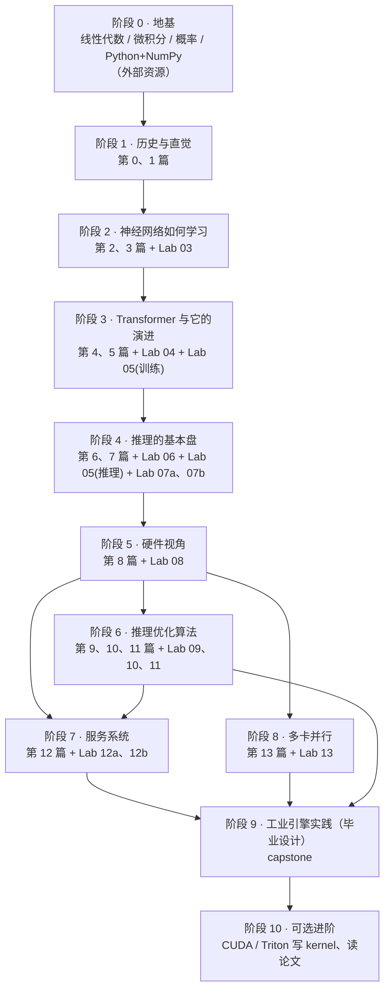

# 🧭 大模型推理：从零到"真正理解"的完整学习路径

> 这份文档回答三个问题：**先学什么、后学什么、学到什么程度才算过关**。
> 它把本仓库的 14 篇理论文章（`zero_to_hero_tutorial/00~13`）、配套实验（`labNN_*` 目录）和外部最好的资源串成一条有依赖关系的路径。
>
> 📌 **编号规则**：理论文章**按阅读顺序编号**，从第 0 篇读到第 13 篇即可；实验目录 `labNN_*` 的 **NN 就是它配套的那一篇**（一篇配多个实验时用 a/b 区分，例如 `lab12a`、`lab12b`）。唯一的例外是毕业设计 `capstone_engines_practice`，它综合用到所有章节。

---

## 🗺️ 总览：依赖关系图



**预计时间**（每周 8~10 小时）：阶段 0 视基础 0~4 周；阶段 1~4 约 5 周；阶段 5~8 约 5 周；阶段 9 约 2 周。总计约 3 个月。不要赶——每个阶段的"出关检验"答不出来，就不要进入下一阶段。

---

## 🛠️ 开始之前：环境

```bash
python3 -m venv .venv && source .venv/bin/activate
pip install -r requirements.txt
# RTX 50 系（Blackwell，如 RTX 5060 Ti）必须用 CUDA 12.8 的 PyTorch，cu124 不支持：
pip install torch --index-url https://download.pytorch.org/whl/cu128
python -c "import torch; print(torch.cuda.is_available(), torch.cuda.get_device_name(0))"
```
阶段 1~2 的脚本只需要 Python 标准库；阶段 3 起需要 PyTorch。

**关于实验里的数字**：
- 所有脚本都带有断言：正确性结论（误差、对拍、公式等式、无偏性）不成立时会直接报错，不会"打印了错误结果却看起来一切正常"。
- 计时类数字（带宽、ms/token、加速比）依赖显卡状态：请在显卡空闲时运行，看**量级、趋势和比例**。README 里的计时数字都只是某一次运行的示例。
- Lab 05 的训练语料就是本仓库的文档，所以字表大小 V、损失值会随文档增删而略有变化。

---

## 阶段 0 · 地基（按需补，不要全学完再开始）

这一阶段**不是**让你把大学数学重学一遍，而是补齐后面会**真正用到**的那几块。下表告诉你每块知识在哪一篇被用到——可以先往后学，卡住了再回来补。

| 知识点 | 在哪里被用到 | 推荐资源（只看列出的部分） |
| :--- | :--- | :--- |
| 向量、点积、矩阵乘法 = 线性变换 | 第 2、4 篇起处处用到 | [3Blue1Brown《线性代数的本质》](https://www.3blue1brown.com/topics/linear-algebra) 第 1~4、9 集（向量、线性组合、矩阵即变换、矩阵乘法即复合、点积与对偶） |
| 矩阵形状与转置、分块矩阵 | 第 3 篇 §4、第 13 篇张量并行 | [MIT 18.06（Gilbert Strang）](https://ocw.mit.edu/courses/18-06-linear-algebra-spring-2010/) 第 1~3 讲；或《动手学深度学习》[2.3 线性代数](https://zh.d2l.ai/chapter_preliminaries/linear-algebra.html) |
| 导数、链式法则、偏导数 | 第 3 篇全篇 | [3Blue1Brown《微积分的本质》](https://www.3blue1brown.com/topics/calculus) 第 1~4 集 |
| 指数、对数、$e^x$ 的性质 | 第 2 篇 Softmax、第 7 篇温度、第 3 篇交叉熵 | 高中数学即可；不熟的话看《微积分的本质》第 5 集（$e$ 的由来） |
| 复数与欧拉公式 $e^{i\theta} = \cos\theta + i\sin\theta$、旋转矩阵 | 第 4 篇 §6 RoPE | 3Blue1Brown 视频 *e^(iπ) in 3.14 minutes, using dynamics*；[Mathematics for Machine Learning](https://mml-book.github.io/) 第 3.9 节（旋转） |
| 期望、方差、独立性、$\text{Var}(cX) = c^2\text{Var}(X)$ | 第 4 篇 §3（为什么除以 $\sqrt{d_k}$）、第 3 篇 §8 初始化 | [Seeing Theory](https://seeing-theory.brown.edu/) 第 1~3 章（交互式）；或 MML 第 6.1~6.4 节 |
| 条件概率、概率的链式法则 | 第 1 篇（语言模型定义）、第 10 篇（投机解码证明） | Seeing Theory 第 3 章；MML 第 6.3 节 |
| Python、NumPy 数组与广播 | 所有实验 | 《动手学深度学习》[2.1 数据操作](https://zh.d2l.ai/chapter_preliminaries/ndarray.html)、[2.2 数据预处理](https://zh.d2l.ai/chapter_preliminaries/pandas.html)；[NumPy 官方入门](https://numpy.org/doc/stable/user/absolute_beginners.html) |

**出关检验**：能手算 $[1,2] \cdot [3,4]$；能说出 $[2,3] \times [3,4]$ 的结果形状；能求 $\frac{d}{dx}\ln(1 + e^{x})$；能说出两个独立随机变量之和的方差等于什么。

---

## 阶段 1 · 历史与直觉：为什么会走到今天

| 类型 | 内容 |
| :--- | :--- |
| 读 | [第 0 篇：AI 演化全景族谱](zero_to_hero_tutorial/00_AI演化全景族谱与零基础入门指南.md) → [第 1 篇：从人工规则到大模型](zero_to_hero_tutorial/01_人类如何让计算机理解语言：从规则到大模型演进史.md) |
| 看 | [3Blue1Brown 神经网络系列](https://www.3blue1brown.com/topics/neural-networks) 第 1 集（神经网络是什么） |

**这一阶段只求建立"地图"**：规则 → 统计 → 神经网络 → RNN → Transformer，每一代被什么问题逼出了下一代。细节会在第 3、5 篇补全（第 1 篇没讲的 Bengio 2003、Seq2Seq 瓶颈、Bahdanau 注意力，都在第 5 篇）。

**出关检验**：用自己的话说清 N-gram 的两个死穴、RNN 被淘汰的两个原因。

---

## 阶段 2 · 神经网络如何学习

| 类型 | 内容 |
| :--- | :--- |
| 读 | [第 2 篇：向量、点积与 Softmax](zero_to_hero_tutorial/02_必备数学直觉：向量、空间变换、点积与Softmax深度推导.md) → [第 3 篇：导数、链式法则、反向传播与交叉熵](zero_to_hero_tutorial/03_神经网络如何学习：导数、链式法则、反向传播与交叉熵.md) |
| 做 | [Lab 03：从零手写自动求导](lab03_autograd_from_scratch/)（纯 Python，验证第 3 篇每一个公式） |
| 看（强烈推荐） | 3Blue1Brown 神经网络系列第 2~4 集；[Karpathy Zero to Hero 第 1 集：micrograd](https://karpathy.ai/zero-to-hero.html)（跟着敲一遍） |
| 选读 | [CS231n 反向传播讲义](https://cs231n.github.io/optimization-2/)、[The Matrix Calculus You Need For Deep Learning](https://explained.ai/matrix-calculus/) |

> 💡 为什么反向传播（第 3 篇）要放在 Transformer（第 4 篇）之前？因为第 4 篇"除以 $\sqrt{d_k}$ 防止梯度消失"的论证要用到 Softmax 的导数，而那个导数在第 3 篇推导。

**出关检验**：第 3 篇末尾的 6 道自测题；并完成 Lab 03 README 里的练习 1（给 `Value` 加 `silu` 并做梯度检验）。

---

## 阶段 3 · Transformer 与它七年的演进

| 类型 | 内容 |
| :--- | :--- |
| 读 | [第 4 篇：Transformer 核心公式推导](zero_to_hero_tutorial/04_Transformer核心公式的彻底推导：每一个符号从何而来.md) → [第 5 篇：从原版 Transformer 到 Llama / DeepSeek](zero_to_hero_tutorial/05_从原版Transformer到Llama与DeepSeek：每一处改动的历史动机.md) |
| 做 | [Lab 04](lab04_transformer_microscope/) 的脚本 01（张量形状逐步追踪）、02（位置编码、RoPE、因果掩码）→ [Lab 05](lab05_train_tiny_llama/) 的 `train.py`（亲手训练一个迷你 Llama） |
| 看 | [Karpathy：Let's build GPT](https://karpathy.ai/zero-to-hero.html)（第 7 集）；[The Illustrated Transformer](https://jalammar.github.io/illustrated-transformer/) |
| 选读 | [The Annotated Transformer](https://nlp.seas.harvard.edu/annotated-transformer/)；[苏剑林：RoPE](https://kexue.fm/archives/8265)；Karpathy：Let's build the GPT Tokenizer（第 8 集） |

**出关检验**：
- 不看资料，写出单头因果注意力的完整公式和每一步的张量形状；
- 解释为什么 Llama-7B 的 FFN 中间维度是 11008；
- Lab 05 练习 1、2（把 GQA 改成 MHA、去掉 RoPE，预测并验证结果）。

---

## 阶段 4 · 推理的基本盘

| 类型 | 内容 |
| :--- | :--- |
| 读 | [第 6 篇：自回归生成与 KV Cache](zero_to_hero_tutorial/06_什么是推理：自回归生成全生命周期与KVCache代数证明.md) → [第 7 篇：Logits、温度与采样](zero_to_hero_tutorial/07_大模型的决策大脑：Logits、温度系数极限证明与采样算法.md) |
| 做 | [Lab 06](lab06_kv_cache/)（KV Cache 等价性）→ [Lab 07a](lab07a_sampling/)（采样策略）→ [Lab 05](lab05_train_tiny_llama/) 的 `generate.py` → **[Lab 07b：亲手实现 Qwen2.5 推理并与官方逐位对拍](lab07b_qwen_from_scratch/)** |

Lab 07b 是整条路线**最关键的一步**：不用 `transformers` 的模型类，只读原始权重，自己写完 RMSNorm、RoPE、GQA、SwiGLU、KV Cache、重复惩罚，并与官方输出逐 token 对拍。做完它，你就能读懂任何 Llama 系模型的实现代码。

**出关检验**：
- 推导 KV Cache 的显存公式，并用 Lab 05 的真实缓存张量验证；
- 解释为什么 HF 的 `generate(do_sample=False)` 与纯贪婪结果不同（Lab 07b 实验 5）；
- 完成 Lab 07b 练习 1（去掉 `repeat_interleave`）。

---

## 阶段 5 · 硬件视角：为什么推理是访存受限的

| 类型 | 内容 |
| :--- | :--- |
| 读 | [第 8 篇：GPU 存储层级、FLOPs、算术强度与浮点格式](zero_to_hero_tutorial/08_硬件视角：GPU存储层级、FLOPs、算术强度与浮点格式.md) |
| 做 | [Lab 08](lab08_memory_and_roofline/)：先跑 `memory_calculator.py`，再跑 `measure_gpu_roofline.py`（**在你自己的卡上**测出带宽、算力与拐点） |
| 看（必读） | Horace He：[Making Deep Learning Go Brrrr](https://horace.io/brrr_intro.html)；kipply：[Transformer Inference Arithmetic](https://kipp.ly/transformer-inference-arithmetic/) |
| 选读 | [How to Scale Your Model](https://jax-ml.github.io/scaling-book/) 第 1 章（Rooflines）；NVIDIA [GPU Performance Background](https://docs.nvidia.com/deeplearning/performance/dl-performance-gpu-background/index.html) |

这是从"懂模型"到"懂推理系统"的**分水岭**。后面所有优化（FlashAttention、量化、批处理、投机解码、张量并行）都是在回答同一个问题：**怎么在访存受限的条件下少搬数据、多做计算**。

**出关检验**：
- 推导"Decode 线性层的算术强度 ≈ batch size"和"Decode 注意力的算术强度 ≈ GQA 分组大小"；
- 用你实测的带宽，估算 Qwen2.5-7B 在 BF16 和 INT4 下 batch=1 的 Decode 上限；
- 解释 Lab 07b 的手写实现为什么只达到带宽上限的 13%。

---

## 阶段 6 · 推理优化算法

可以按任意顺序学习三个主题，但都需要阶段 5。

| 主题 | 读 | 做 |
| :--- | :--- | :--- |
| FlashAttention | [第 9 篇](zero_to_hero_tutorial/09_FlashAttention：OnlineSoftmax的严格推导与IO复杂度.md) + [From Online Softmax to FlashAttention](https://courses.cs.washington.edu/courses/cse599m/23sp/notes/flashattn.pdf) | [Lab 09](lab09_flash_attention/) |
| 投机解码 | [第 10 篇](zero_to_hero_tutorial/10_投机解码：无偏性证明与期望加速比.md) | [Lab 10](lab10_speculative_decoding/)：先跑 `verify_unbiasedness.py`，再跑 `toy_speculative_decoding.py` |
| 量化 | [第 11 篇](zero_to_hero_tutorial/11_量化：从每位6dB到SmoothQuant、AWQ与GPTQ.md) + [A Visual Guide to Quantization](https://newsletter.maartengrootendorst.com/p/a-visual-guide-to-quantization) | [Lab 11](lab11_quantization/)：`quant_basics.py` → `advanced_quant_numpy.py` |

**出关检验**：
- 写出投机采样单 token 无偏性的完整证明；
- 写出 Online Softmax 的更新公式并证明它的正确性；
- 解释为什么 GPTQ 的权重误差更大、输出误差却更小。

---

## 阶段 7 · 推理服务系统

| 类型 | 内容 |
| :--- | :--- |
| 读 | [第 12 篇：PagedAttention、前缀缓存与调度](zero_to_hero_tutorial/12_推理服务系统：PagedAttention、前缀缓存与调度.md) |
| 做 | [Lab 12a](lab12a_continuous_batching/)（连续批处理）→ [Lab 12b](lab12b_paged_attention/)（块分配、写时复制、前缀缓存、Chunked Prefill） |
| 读论文 | [vLLM / PagedAttention](https://arxiv.org/abs/2309.06180)（必读）；[Orca](https://www.usenix.org/conference/osdi22/presentation/yu)；[Sarathi-Serve](https://arxiv.org/abs/2403.02310) |

**出关检验**：第 12 篇自测题；并完成 Lab 12b 练习 1（把前缀缓存和块分配器接起来）。

---

## 阶段 8 · 多卡并行

| 类型 | 内容 |
| :--- | :--- |
| 读 | [第 13 篇：张量并行、流水线并行与专家并行](zero_to_hero_tutorial/13_多卡并行推理：张量并行、流水线并行与专家并行.md) |
| 做 | [Lab 13](lab13_parallelism/) |
| 读论文 | [Megatron-LM](https://arxiv.org/abs/1909.08053) 第 3 节；[Efficiently Scaling Transformer Inference](https://arxiv.org/abs/2211.05102) |

**出关检验**：解释 Megatron "先列后行"的切法为什么每个子层只需一次 All-Reduce；估算 PCIe 上 TP=2 是否值得。

---

## 阶段 9 · 工业引擎实践（毕业设计）

[capstone_engines_practice](capstone_engines_practice/)：用 vLLM 和 llama.cpp 在你自己的显卡上部署，用 `bench_openai_server.py` 测 TTFT / TPOT / 吞吐，**先预测、再测量、再解释**；然后按 nano-vllm → gpt-fast → vLLM → llama.cpp 的顺序读源码。

**毕业标准**：写出 capstone README 末尾描述的那份"预测 vs 实测"报告，并能把每一处差距归因到具体的公式或工程因素。

---

## 阶段 10 · 可选进阶方向

| 方向 | 资源 |
| :--- | :--- |
| 自己写 GPU kernel | 教材 *Programming Massively Parallel Processors*（PMPP）；[GPU MODE 讲座](https://github.com/gpu-mode/lectures)；[Triton 官方教程](https://triton-lang.org/main/getting-started/tutorials/index.html)（矩阵乘 → Fused Softmax → Fused Attention） |
| 系统化课程 | [Stanford CS336: Language Modeling from Scratch](https://stanford-cs336.github.io/)（从分词器、训练、系统优化到推理的完整作业） |
| 训练侧 | [The Ultra-Scale Playbook](https://huggingface.co/spaces/nanotron/ultrascale-playbook)；[How to Scale Your Model](https://jax-ml.github.io/scaling-book/) 全书 |
| 综述 | Lilian Weng：[Large Transformer Model Inference Optimization](https://lilianweng.github.io/posts/2023-01-10-inference-optimization/) |
| 前沿专题 | MoE 推理与专家并行（DeepSeek-V3 技术报告）、长上下文（YaRN、StreamingLLM）、KV Cache 压缩（KIVI）、P/D 分离（DistServe、Mooncake） |

---

## 🔁 卡住了怎么办：回头补哪里

| 卡在这里 | 回去补 |
| :--- | :--- |
| 第 4 篇"为什么除以 $\sqrt{d_k}$"的方差推导 | 阶段 0 的期望与方差；第 3 篇 §6（Softmax 导数） |
| 第 4 篇 RoPE 的旋转矩阵推导 | 阶段 0 的复数与欧拉公式、旋转矩阵；再跑 Lab 04 脚本 02 |
| 第 4 篇残差连接的梯度推导 | 第 3 篇 §2（链式法则）、§7（加法通路） |
| 第 6 篇"Prefill 算力受限、Decode 访存受限"只会背不会推 | 第 8 篇 §2~§4 |
| 第 7 篇温度极限的证明 | 第 2 篇 §5（平移不变性）、极限 $\lim_{x \to -\infty} e^x = 0$ |
| 看不懂 `config.json` 里的字段 | 第 5 篇 §5；Lab 07b 实验 1 |
| Lab 05/07b 的张量形状对不上 | Lab 04 脚本 01（逐步打印形状）；第 3 篇 §4 的形状对齐法 |
| 第 9 篇 FlashAttention 的推导 | 第 2 篇 §5（Safe Softmax）；第 8 篇 §5（算子融合） |
| 第 12 篇为什么连续批处理能成立 | 第 8 篇 §4.1（算术强度 ≈ batch） |
| 第 10 篇投机解码证明 | 阶段 0 的概率基础；第 7 篇（采样） |
| 第 11 篇 GPTQ 的公式 | 第 3 篇 §4（矩阵求导）；线性代数中的矩阵求逆 |
| 第 13 篇张量并行的切法 | 阶段 0 的分块矩阵乘法；第 3 篇 §4 |

---

## 📋 全部内容索引

| 理论文章 | 配套实验 |
| :--- | :--- |
| 第 0 篇（导读）AI 演化全景 | — |
| 第 1 篇 从规则到大模型 | —（Lab 03 实验 6 重演了 XOR 那段历史） |
| 第 2 篇 向量、点积、Softmax | —（公式在 Lab 03、Lab 04 中被数值验证） |
| 第 3 篇 导数、反向传播、交叉熵 | [lab03_autograd_from_scratch](lab03_autograd_from_scratch/) |
| 第 4 篇 Transformer 公式推导 | [lab04_transformer_microscope](lab04_transformer_microscope/) |
| 第 5 篇 架构演进史 | [lab05_train_tiny_llama](lab05_train_tiny_llama/)（`train.py` 在本阶段做，`generate.py` 读完第 6、7 篇再做） |
| 第 6 篇 自回归与 KV Cache | [lab06_kv_cache](lab06_kv_cache/) |
| 第 7 篇 Logits 与采样 | [lab07a_sampling](lab07a_sampling/)、[lab07b_qwen_from_scratch](lab07b_qwen_from_scratch/)（手写 Qwen2.5，综合第 4~8 篇） |
| 第 8 篇 硬件视角 | [lab08_memory_and_roofline](lab08_memory_and_roofline/) |
| 第 9 篇 FlashAttention | [lab09_flash_attention](lab09_flash_attention/) |
| 第 10 篇 投机解码 | [lab10_speculative_decoding](lab10_speculative_decoding/) |
| 第 11 篇 量化 | [lab11_quantization](lab11_quantization/) |
| 第 12 篇 推理服务系统 | [lab12a_continuous_batching](lab12a_continuous_batching/)、[lab12b_paged_attention](lab12b_paged_attention/) |
| 第 13 篇 多卡并行 | [lab13_parallelism](lab13_parallelism/) |
| — | [capstone_engines_practice](capstone_engines_practice/)（引擎实践，毕业设计） |
