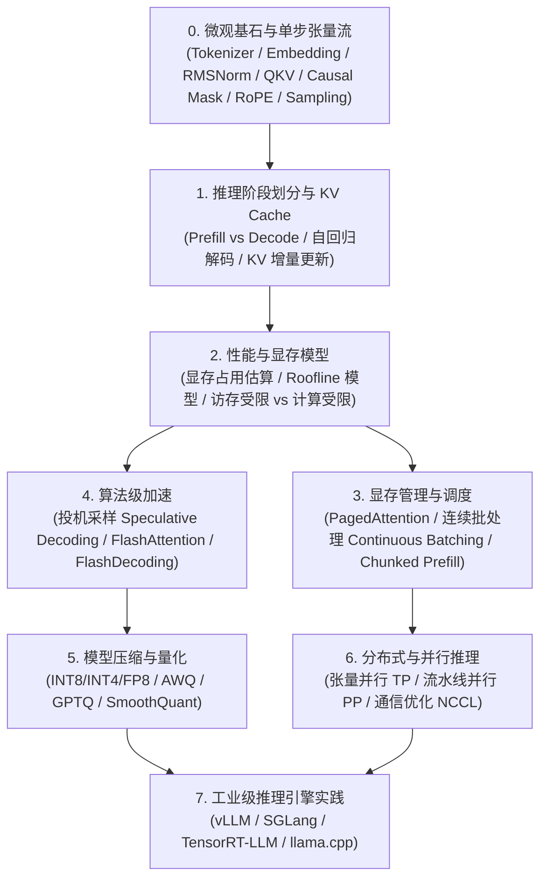

# 🚀 大模型推理（LLM Inference）系统学习指南

欢迎开启大模型推理学习之旅！

在现代 AI 系统中，**模型训练是「一次性成本」，而模型推理是「长期且持续膨胀的在线成本」**。大模型推理的瓶颈通常不是算力（Compute Bound），而是**显存容量与内存带宽（Memory Bandwidth Bound）**。理解并掌握大模型推理的核心机制，是从事 AI Infra、算法部署和高性能计算（HPC）的关键技能。

---

## 🌟 【零基础首选】小白到精通·原理与数学公式完整推导教程

> 适合人群：**没有任何深度学习基础、对公式推导和历史背景充满好奇的零基础学习者**。包含从 1950 年代规则系统到 Transformer 的完整演进史，以及所有核心公式的逐行代数证明：

0. 🌳 **[【导学全景】AI 深度学习全景族谱与零基础入门指南](zero_to_hero_tutorial/00_AI演化全景族谱与零基础入门指南.md)**
   - 从感知机到 CNN、ResNet、RNN、Transformer 的科技树全景族谱，各种“Net”到底都是干什么的，不踩坑入门资源与学习路线。
1. 📖 **[第 1 篇：计算机如何读懂语言？从人工规则到大模型演进史](zero_to_hero_tutorial/01_人类如何让计算机理解语言：从规则到大模型演进史.md)**
   - 计算机的本质、人工规则为何崩溃、N-gram 语言模型、神经网络与反向传播底座、RNN/LSTM 的长程遗忘与并行死穴、Transformer 的颠覆。
2. 📐 **[第 2 篇：零基础必备数学直觉：向量、空间变换、点积与 Softmax 深度推导](zero_to_hero_tutorial/02_必备数学直觉：向量、空间变换、点积与Softmax深度推导.md)**
   - 标量/向量/张量物理本质、点积与余弦夹角几何意义（为什么代表相似度）、矩阵乘法的空间投影本质、Softmax 的指数来源与防溢出平移不变性证明。
3. 🧮 **[第 3 篇：Transformer 核心公式彻底推导：每一个符号从何而来](zero_to_hero_tutorial/03_Transformer核心公式的彻底推导：每一个符号从何而来.md)**
   - Q/K/V 检索设计、**【重点推导】为什么必须除以 $\sqrt{d_k}$（独立变量方差爆炸与 Softmax 梯度消失严格证明）**、因果掩码 $-\infty$、残差连接常数导数高速公路、RoPE 相对位置内积恒等性证明。
4. ⚡ **[第 4 篇：什么是推理？自回归生成全生命周期与 KV Cache 代数证明](zero_to_hero_tutorial/04_什么是推理：自回归生成全生命周期与KVCache代数证明.md)**
   - 训练与推理的本质鸿沟、Prefill（算力受限）vs Decode（访存受限）、KV Cache 代数展开冗余消除证明、显存爆炸计算公式与 PagedAttention 诞生背景。
5. 🧠 **[第 5 篇：大模型的决策大脑：Logits、温度系数极限证明与采样算法](zero_to_hero_tutorial/05_大模型的决策大脑：Logits、温度系数极限证明与采样算法.md)**
   - LM Head 词表投影、**【定理推导】温度参数 $T \to 0$（狄拉克 $\delta$ 贪婪收敛）与 $T \to \infty$（均匀分布）严格数学极限证明**、Top-K 截断、Top-P 动态核采样与重复惩罚。

---

## 🗺️ 学习路线图 (Learning Roadmap)

---

## 📂 本学习仓库目录结构

每个目录均配有**原理解析文档**与**可直接运行的 Python 仿真/基准测试代码**：

| 模块 | 目录 | 核心内容 | 重点代码 |
| :--- | :--- | :--- | :--- |
| **00** | [`00_micro_foundations/`](00_micro_foundations/) | **【极细基础】**从分词到下一个字的微观全貌、张量维度流动、RoPE 旋转推导、采样算法 | `01_tensor_trace_step_by_step.py` `02_rope_and_attention_microscope.py` `03_sampling_strategies.py` |
| **01** | [`01_kv_cache_fundamentals/`](01_kv_cache_fundamentals/) | Prefill 与 Decode 阶段区别、自回归生成的重复计算痛点、KV Cache 机制与代码对比 | `kv_cache_benchmark.py` |
| **02** | [`02_memory_and_roofline/`](02_memory_and_roofline/) | 模型权重、KV Cache、激活值显存计算，计算密度（Arithmetic Intensity）与 Roofline 模型分析 | `memory_calculator.py` |
| **03** | [`03_speculative_decoding/`](03_speculative_decoding/) | 投机采样（Speculative Decoding）核心思想、草稿模型生成与主模型并行验证算法 | `toy_speculative_decoding.py` |
| **04** | [`04_quantization/`](04_quantization/) | 对称与非对称量化、Per-Tensor / Per-Channel / Per-Group 量化、AWQ / GPTQ 原理 | `quant_basics.py` |
| **05** | [`05_batching_and_scheduling/`](05_batching_and_scheduling/) | 静态 Batching 的「气泡（Padding/Bubble）」问题、迭代级调度（Continuous Batching）仿真 | `continuous_batching_sim.py` |

---

## 🧠 核心概念速查手册

### 1. Prefill（首字）vs Decode（增量生成）阶段

- **Prefill 阶段（首字延迟 TTFT: Time to First Token）**：
  - 输入所有 prompt tokens，能够并行计算。
  - 特征：**Compute-bound（算力受限）**，GPU 利用率高，矩阵乘法规模大 ($M \times K \times N$, $M > 1$)。
- **Decode 阶段（每个后续 token 的延迟 TPOT: Time Per Output Token）**：
  - 串行逐字生成，每次输入仅 1 个 token。
  - 特征：**Memory-bound（访存带宽受限）**。每次生成 1 个 token 都需要把数十亿参数和全部历史 KV Cache 从显存搬运进 GPU 计算核心。

### 2. KV Cache 显存占用计算公式

对于标准 Transformer 结构模型：
- 参数量：$P$
- 层数：$L$
- 隐藏层大小：$H$ 或注意力头数 $n_{\text{heads}} \times d_{\text{head}}$
- 上下文总长度（Prompt + Generated）：$S$
- 批大小：$B$
- 精度字节数：$b$（FP16/BF16 为 2 字节，FP8/INT8 为 1 字节，INT4 为 0.5 字节）

每个 Token 产生的 Key 和 Value 向量显存（bytes）：
$$ \text{KV per token} = 2 \times L \times H \times b $$
*(注：如果采用 MQA/GQA，隐藏层维度 $H$ 需按 KV 组数比例缩减，例如 GQA-8 缩减为原来的 $1/8$)*

批次总 KV Cache 显存（bytes）：
$$ \text{Total KV Cache} = B \times S \times 2 \times L \times H \times b $$

> **示例（Llama-3-8B, 32 层, 隐藏层 4096, GQA 8 个 KV 头 vs 32 个 Q 头, FP16）：**
> 每个 token 仅需要 $2 \times 32 \times (4096/4) \times 2 = 131,072 \text{ bytes} \approx 128 \text{ KB}$。
> 长度 8192 时，单并发约 1 GB，若并发达 32，则需 32 GB 显存（远超模型权重自身的 16 GB）！

---

## 🛠️ 主流推理引擎横向对比

| 框架 | 适用场景 | 核心亮点 | 推荐初学者体验 |
| :--- | :--- | :--- | :--- |
| **[vLLM](https://github.com/vllm-project/vllm)** | 工业界高吞吐部署标准 | PagedAttention 显存零浪费、Continuous Batching、广泛支持各类模型 | ⭐⭐⭐⭐⭐ |
| **[SGLang](https://github.com/sgl-project/sglang)** | 复杂 Prompt、Agent/结构化生成、超高吞吐 | RadixAttention（自动 KV 复用）、高性能 Runtime | ⭐⭐⭐⭐⭐ |
| **[TensorRT-LLM](https://github.com/NVIDIA/TensorRT-LLM)** | NVIDIA 极致性能压榨 | 深度融合 Kernel、In-flight Batching、FP8/FP4 极致调优 | ⭐⭐⭐⭐ |
| **[llama.cpp](https://github.com/ggerganov/llama.cpp)** | 边缘设备、CPU、Mac、本地轻量推理 | 零依赖纯 C++、极致 GGUF 量化支持 | ⭐⭐⭐⭐⭐ |
| **[TGI (Text Generation Inference)](https://github.com/huggingface/text-generation-inference)** | Hugging Face 生态生产部署 | 简单可靠、支持 FlashAttention、生产级运维特性 | ⭐⭐⭐⭐ |

---

## 🎯 推荐第一步

1. 先阅读并运行 [`01_kv_cache_fundamentals/kv_cache_benchmark.py`](file:///home/yuan/antigravity/sharp-volta/llm_inference/01_kv_cache_fundamentals/kv_cache_benchmark.py)，直观理解 KV Cache 为什么是现代大模型推理的基石。
2. 运行 [`02_memory_and_roofline/memory_calculator.py`](file:///home/yuan/antigravity/sharp-volta/llm_inference/02_memory_and_roofline/memory_calculator.py)，输入你的显卡配置（例如本机自带的 RTX 5060 Ti 16GB），估算能跑多大模型与多少上下文。
