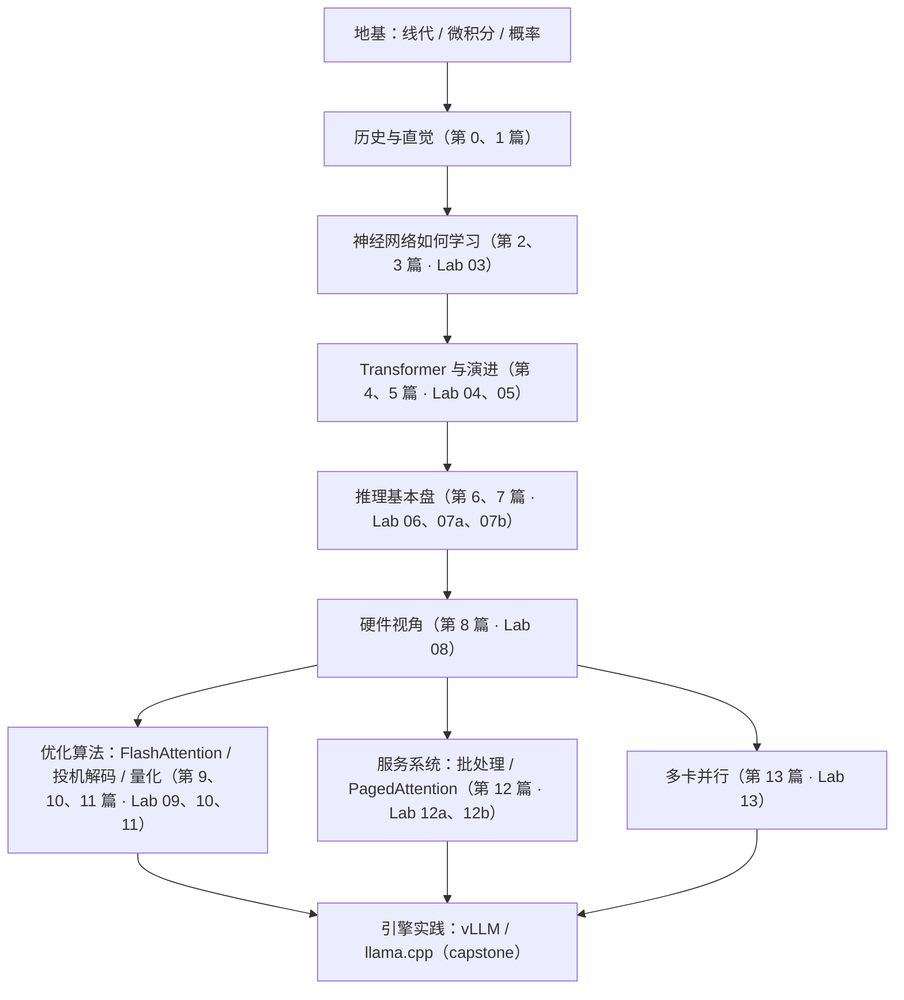

# 🚀 大模型推理（LLM Inference）系统学习指南

欢迎开启大模型推理学习之旅！

在现代 AI 系统中，**模型训练是「一次性成本」，而模型推理是「长期且持续膨胀的在线成本」**。大模型推理的瓶颈通常不是算力（Compute Bound），而是**显存容量与内存带宽（Memory Bandwidth Bound）**。理解并掌握大模型推理的核心机制，是从事 AI Infra、算法部署和高性能计算（HPC）的关键技能。

---

## 🧭 从这里开始

**👉 先读 [LEARNING_PATH.md：完整学习路径](LEARNING_PATH.md)。** 它规定了先学什么、后学什么、每个阶段需要先补哪些外部资源（具体到哪一集、哪一章），以及每个阶段的"出关检验"和"卡住了回去补哪里"。
下面的列表只是索引。

**环境准备**（RTX 50 系显卡必须使用 CUDA 12.8 版本的 PyTorch）：
```bash
python3 -m venv .venv && source .venv/bin/activate
pip install -r requirements.txt
pip install torch --index-url https://download.pytorch.org/whl/cu128
```

---

## 🌟 【零基础首选】小白到精通·原理与数学公式完整推导教程

> 适合人群：**没有任何深度学习基础、对公式推导和历史背景充满好奇的零基础学习者**。包含从 1950 年代规则系统到 Transformer 的完整演进史，以及所有核心公式的逐行代数证明：

0. 🌳 **[第 0 篇（导读）：AI 深度学习全景族谱与零基础入门指南](zero_to_hero_tutorial/00_AI演化全景族谱与零基础入门指南.md)**
   - 从感知机到 CNN、ResNet、RNN、Transformer 的科技树全景族谱，各种“Net”到底都是干什么的，不踩坑入门资源与学习路线。
1. 📖 **[第 1 篇：计算机如何读懂语言？从人工规则到大模型演进史](zero_to_hero_tutorial/01_人类如何让计算机理解语言：从规则到大模型演进史.md)**
   - 计算机的本质、人工规则为何崩溃、N-gram 语言模型、神经网络与反向传播底座、RNN/LSTM 的长程遗忘与并行死穴、Transformer 的颠覆。
2. 📐 **[第 2 篇：零基础必备数学直觉：向量、空间变换、点积与 Softmax 深度推导](zero_to_hero_tutorial/02_必备数学直觉：向量、空间变换、点积与Softmax深度推导.md)**
   - 标量/向量/张量物理本质、点积与余弦夹角几何意义（为什么代表相似度）、矩阵乘法的空间投影本质、Softmax 的指数来源与防溢出平移不变性证明。
3. 🔁 **[第 3 篇：神经网络如何学习：导数、链式法则、反向传播与交叉熵](zero_to_hero_tutorial/03_神经网络如何学习：导数、链式法则、反向传播与交叉熵.md)**
   - 梯度为什么指向下山方向（证明）、反向传播为什么比其它求导方法快、矩阵乘反向公式 $X^TG$ / $GW^T$、交叉熵 = 最大似然、困惑度、**Softmax 雅可比与 $p - y$ 梯度的完整推导**、梯度消失与"加法通路"、训练 6N vs 推理 2N、训练与推理的显存账本。
4. 🧮 **[第 4 篇：Transformer 核心公式彻底推导：每一个符号从何而来](zero_to_hero_tutorial/04_Transformer核心公式的彻底推导：每一个符号从何而来.md)**
   - Q/K/V 检索设计、**【重点推导】为什么必须除以 $\sqrt{d_k}$（独立变量方差爆炸与 Softmax 梯度消失严格证明）**、因果掩码 $-\infty$、残差连接常数导数高速公路、RoPE 相对位置内积恒等性证明。
5. 🏛️ **[第 5 篇：从原版 Transformer 到 Llama / DeepSeek：每一处改动的历史动机](zero_to_hero_tutorial/05_从原版Transformer到Llama与DeepSeek：每一处改动的历史动机.md)**
   - 注意力的真正起源（Bengio 2003 → Seq2Seq 瓶颈 → Bahdanau）、BPE 分词与词表大小的推理代价、为什么仅解码器胜出、规模定律与"推理成本成为主问题"、Pre-LN / RMSNorm / SwiGLU / RoPE / MQA→GQA→MLA / MoE 每一处改动的动机。
6. ⚡ **[第 6 篇：什么是推理？自回归生成全生命周期与 KV Cache 代数证明](zero_to_hero_tutorial/06_什么是推理：自回归生成全生命周期与KVCache代数证明.md)**
   - 训练与推理的本质鸿沟、Prefill（算力受限）vs Decode（访存受限）、KV Cache 代数展开冗余消除证明、显存爆炸计算公式与 PagedAttention 诞生背景。
7. 🧠 **[第 7 篇：大模型的决策大脑：Logits、温度系数极限证明与采样算法](zero_to_hero_tutorial/07_大模型的决策大脑：Logits、温度系数极限证明与采样算法.md)**
   - LM Head 词表投影、**【定理推导】温度参数 $T \to 0$（狄拉克 $\delta$ 贪婪收敛）与 $T \to \infty$（均匀分布）严格数学极限证明**、Top-K 截断、Top-P 动态核采样与重复惩罚。
8. 🏭 **[第 8 篇：硬件视角：GPU 存储层级、FLOPs、算术强度与浮点格式](zero_to_hero_tutorial/08_硬件视角：GPU存储层级、FLOPs、算术强度与浮点格式.md)**
   - Roofline 模型、**推导"Decode 线性层算术强度 ≈ batch size"与"Decode 注意力算术强度 ≈ GQA 分组大小"**、Decode 耗时模型、算子融合、FP32 / BF16 / FP16 / FP8 / FP4 的位布局与精度陷阱。
9. ⚡ **[第 9 篇：FlashAttention：Online Softmax 的严格推导与 IO 复杂度](zero_to_hero_tutorial/09_FlashAttention：OnlineSoftmax的严格推导与IO复杂度.md)**
   - Online Softmax 的归纳法证明、分块注意力、IO 复杂度、FlashDecoding 的 split-K 合并公式及其结合律。
10. 🎲 **[第 10 篇：投机解码：无偏性证明与期望加速比](zero_to_hero_tutorial/10_投机解码：无偏性证明与期望加速比.md)**
    - **投机采样无偏性定理的完整证明**、接受率与总变差距离、期望加速比公式与最优 K、为什么大 batch 时收益消失。
11. 🧊 **[第 11 篇：量化：从每位 6 dB 到 SmoothQuant、AWQ 与 GPTQ](zero_to_hero_tutorial/11_量化：从每位6dB到SmoothQuant、AWQ与GPTQ.md)**
    - 每位 6 dB 规律、激活离群值、量化权重还是激活（由 Roofline 决定）、SmoothQuant / AWQ / GPTQ 的数学原理（含两变量的 GPTQ 直观例子）。
12. 🗄️ **[第 12 篇：推理服务系统：PagedAttention、前缀缓存与调度](zero_to_hero_tutorial/12_推理服务系统：PagedAttention、前缀缓存与调度.md)**
    - TTFT / TPOT / Goodput 指标、Little 定律、显存碎片与分页、写时复制、前缀缓存、Chunked Prefill 与 P/D 分离。
13. 🌐 **[第 13 篇：多卡并行推理：张量并行、流水线并行与专家并行](zero_to_hero_tutorial/13_多卡并行推理：张量并行、流水线并行与专家并行.md)**
    - 通信原语与 Ring All-Reduce、Megatron "先列后行"切法的推导、PP 为什么不降延迟、MoE 的专家并行。

---

## 🗺️ 学习路线图 (Learning Roadmap)

完整的阶段划分、前置条件与外部资源见 **[LEARNING_PATH.md](LEARNING_PATH.md)**。简版：



---

## 📂 本学习仓库目录结构

实验目录 `labNN_*` 的 **NN 就是它配套的那一篇**（一篇配多个实验时用 a/b 区分）。每个目录都有说明文档和可直接运行的代码：

| 对应篇 | 目录 | 核心内容 | 重点代码 |
| :--- | :--- | :--- | :--- |
| **第 3 篇** | [`lab03_autograd_from_scratch/`](lab03_autograd_from_scratch/) | 150 行纯 Python 自动求导，数值验证 Softmax 雅可比、交叉熵梯度、矩阵乘反向公式、梯度消失、XOR | `micrograd_from_scratch.py` |
| **第 4 篇** | [`lab04_transformer_microscope/`](lab04_transformer_microscope/) | **【极细基础】**从分词到下一个字的微观全貌、张量维度流动、RoPE 旋转、置换等变性与长程衰减的正确表述 | `01_tensor_trace_step_by_step.py`<br/>`02_rope_and_attention_microscope.py` |
| **第 5 篇** | [`lab05_train_tiny_llama/`](lab05_train_tiny_llama/) | 用本仓库教程做语料训练一个迷你 Llama（RMSNorm / RoPE / GQA / SwiGLU），再做 KV Cache 对拍与采样 | `model.py`<br/>`train.py`<br/>`generate.py` |
| **第 6 篇** | [`lab06_kv_cache/`](lab06_kv_cache/) | Prefill 与 Decode 阶段区别、自回归生成的重复计算痛点、KV Cache 机制与代码对比 | `kv_cache_benchmark.py` |
| **第 7 篇** | [`lab07a_sampling/`](lab07a_sampling/) | Greedy、温度、Top-K、Top-P、重复惩罚的概率分布前后对比 | `sampling_strategies.py` |
| **第 7 篇** | [`lab07b_qwen_from_scratch/`](lab07b_qwen_from_scratch/) | **【关键】**只读原始权重、手写 Qwen2.5 推理，与 HF 官方逐位对拍 logits 与生成结果 | `qwen_from_scratch.py` |
| **第 8 篇** | [`lab08_memory_and_roofline/`](lab08_memory_and_roofline/) | 模型权重、KV Cache、激活值显存计算，计算密度（Arithmetic Intensity）与 Roofline 模型分析 | `memory_calculator.py` |
| **第 9 篇** | [`lab09_flash_attention/`](lab09_flash_attention/) | Online Softmax、分块 FlashAttention、FlashDecoding 合并，GPU 上朴素 vs SDPA | `flash_attention_numpy.py` |
| **第 10 篇** | [`lab10_speculative_decoding/`](lab10_speculative_decoding/) | 投机采样（Speculative Decoding）核心思想、草稿模型生成与主模型并行验证算法 | `toy_speculative_decoding.py` |
| **第 11 篇** | [`lab11_quantization/`](lab11_quantization/) | 对称与非对称量化、Per-Tensor / Per-Channel / Per-Group 量化、AWQ / GPTQ 原理 | `quant_basics.py` |
| **第 12 篇** | [`lab12a_continuous_batching/`](lab12a_continuous_batching/) | 静态 Batching 的「气泡（Padding/Bubble）」问题、迭代级调度（Continuous Batching）仿真 | `continuous_batching_sim.py` |
| **第 12 篇** | [`lab12b_paged_attention/`](lab12b_paged_attention/) | 块分配器、块表、分页注意力、写时复制、前缀缓存、Chunked Prefill | `paged_kv_cache_sim.py` |
| **第 13 篇** | [`lab13_parallelism/`](lab13_parallelism/) | 张量并行 MLP / 注意力、错误切法反例、Ring All-Reduce、多卡 Decode 延迟模型 | `tensor_parallel_sim.py` |
| **毕业设计** | [`capstone_engines_practice/`](capstone_engines_practice/) | vLLM / llama.cpp 部署与压测任务、源码阅读路线（毕业设计） | `bench_openai_server.py` |

Lab 08、10、11 还各新增了进阶脚本：`measure_gpu_roofline.py`（在你的显卡上实测 Roofline）、`verify_unbiasedness.py`（蒙特卡洛验证投机采样定理）、`advanced_quant_numpy.py`（从零实现 SmoothQuant / AWQ / GPTQ）。

---

## 🧠 核心概念速查手册

### 1. Prefill（首字）vs Decode（增量生成）阶段

- **Prefill 阶段（首字延迟 TTFT: Time to First Token）**：
  - 输入所有 prompt tokens，能够并行计算。
  - 特征：**Compute-bound（算力受限）**，GPU 利用率高，矩阵乘法规模大 ($M \times K \times N$, $M > 1$)。
- **Decode 阶段（每个后续 token 的延迟 TPOT: Time Per Output Token）**：
  - 串行逐字生成，每次输入仅 1 个 token。
  - 特征：**Memory-bound（访存带宽受限）**。每次生成 1 个 token 都需要把数十亿参数和全部历史 KV Cache 从显存搬运进 GPU 计算核心。

### 2. KV Cache 显存占用计算公式

对于标准 Transformer 结构模型：
- 参数量：$P$
- 层数：$L$
- 隐藏层大小：$H$ 或注意力头数 $n_{\text{heads}} \times d_{\text{head}}$
- 上下文总长度（Prompt + Generated）：$S$
- 批大小：$B$
- 精度字节数：$b$（FP16/BF16 为 2 字节，FP8/INT8 为 1 字节，INT4 为 0.5 字节）

每个 Token 产生的 Key 和 Value 向量显存（bytes）：
$$ \text{KV per token} = 2 \times L \times H \times b $$
*(注：如果采用 MQA/GQA，隐藏层维度 $H$ 需按 KV 组数比例缩减，例如 GQA-8 缩减为原来的 $1/8$)*

批次总 KV Cache 显存（bytes）：
$$ \text{Total KV Cache} = B \times S \times 2 \times L \times H \times b $$

> **示例（Llama-3-8B, 32 层, 隐藏层 4096, GQA 8 个 KV 头 vs 32 个 Q 头, FP16）：**
> 每个 token 仅需要 $2 \times 32 \times (4096/4) \times 2 = 131,072 \text{ bytes} \approx 128 \text{ KB}$。
> 长度 8192 时，单并发约 1 GB，若并发达 32，则需 32 GB 显存（远超模型权重自身的 16 GB）！

---

## 🛠️ 主流推理引擎横向对比

| 框架 | 适用场景 | 核心亮点 | 推荐初学者体验 |
| :--- | :--- | :--- | :--- |
| **[vLLM](https://github.com/vllm-project/vllm)** | 工业界高吞吐部署标准 | PagedAttention 显存零浪费、Continuous Batching、广泛支持各类模型 | ⭐⭐⭐⭐⭐ |
| **[SGLang](https://github.com/sgl-project/sglang)** | 复杂 Prompt、Agent/结构化生成、超高吞吐 | RadixAttention（自动 KV 复用）、高性能 Runtime | ⭐⭐⭐⭐⭐ |
| **[TensorRT-LLM](https://github.com/NVIDIA/TensorRT-LLM)** | NVIDIA 极致性能压榨 | 深度融合 Kernel、In-flight Batching、FP8/FP4 极致调优 | ⭐⭐⭐⭐ |
| **[llama.cpp](https://github.com/ggml-org/llama.cpp)** | 边缘设备、CPU、Mac、本地轻量推理 | 零依赖纯 C++、极致 GGUF 量化支持 | ⭐⭐⭐⭐⭐ |
| **[TGI (Text Generation Inference)](https://github.com/huggingface/text-generation-inference)** | Hugging Face 生态生产部署 | 简单可靠、支持 FlashAttention、生产级运维特性 | ⭐⭐⭐⭐ |

---

## 🎯 推荐第一步

1. 读 [LEARNING_PATH.md](LEARNING_PATH.md)，对照"阶段 0"的表格检查自己缺哪块数学基础。
2. 读第 0、1 篇建立全局地图，然后按路径进入阶段 2（第 2 篇 → 第 3 篇 → Lab 03）。
3. 想先看到"真东西"提提兴趣的话，可以先跑一下：
   ```bash
   .venv/bin/python lab05_train_tiny_llama/train.py && .venv/bin/python lab05_train_tiny_llama/generate.py
   ```
   30 秒训练出一个会"背诵本教程"的迷你 Llama——然后再回到路径上，把它的每一行都弄懂。
