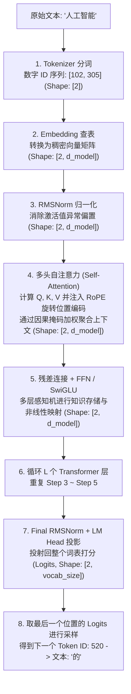

# Lab 04：大模型推理的微观全貌（零起点极细拆解）

如果你对「大模型推理到底在算什么」、「张量每一步怎么变」感到模糊，本模块就是为你量身打造的**显微镜**。

无论模型是 0.5B、7B 还是 70B，无论叫 Llama-3、Qwen2.5 还是 DeepSeek，其自回归推理的**微观数学本质完全一致**。

---

## 🧭 1. 宏观全貌：从一句话到下一个字的 8 个步骤

假设你对模型说：`"人工智能"`，模型要推理出下一个字 `"的"`。整个过程分为严格的 8 步：

---

## 🔍 2. 张量形状流（Tensor Shape Flow Tracker）

理解大模型推理的关键，是死死盯住**每一步张量的形状（Shape）**。
下表用一个**假设的**微型配置来说明形状如何流动（注意：脚本 `01_tensor_trace_step_by_step.py` 为了能把每个数字打印出来，用的是更小的配置：$d_{\text{model}} = 16$、2 个头、词表 11 个字、只有 1 层；下面的流程图描述的是真实模型的 $L$ 层结构）。

假设微型模型配置：
- 序列长度 $T = 3$（例如输入 3 个词）
- 隐藏层维度 $d_{\text{model}} = 64$
- 注意力头数 $n_{\text{heads}} = 4$，每个头的维度 $d_{\text{head}} = 64 / 4 = 16$
- 词表大小 $\text{vocab\_size} = 1000$

| 处理阶段 | 算子名称 | 输入形状 (Input Shape) | 输出形状 (Output Shape) | 物理含义解释 |
| :--- | :--- | :--- | :--- | :--- |
| **分词** | Tokenizer | 字符串文本 | `[3]` | 文本转整数 ID |
| **词嵌入** | Embedding Lookup | `[3]` | `[3, 64]` | 每个词映射成 64 维空间的一个点 |
| **归一化** | RMSNorm | `[3, 64]` | `[3, 64]` | 均方根缩放，保持方差稳定 |
| **QKV投影**| Linear ($W_q, W_k, W_v$) | `[3, 64]` | `[3, 64]` (各 1 个) | 生成查询、键、值向量 |
| **多头拆分**| Reshape & Transpose | `[3, 64]` | `[4, 3, 16]` | 4 个注意力头并行关注不同维度的特征 |
| **位置编码**| RoPE (旋转编码) | `[4, 3, 16]` | `[4, 3, 16]` | 对 Q 和 K 按位置角频率旋转，注入顺序感 |
| **注意力打分**| $Q \cdot K^T / \sqrt{d_k}$ | Q:`[4, 3, 16]`, K:`[4, 3, 16]` | `[4, 3, 3]` | 第 $i$ 个词与第 $j$ 个词的关联度矩阵 |
| **因果掩码**| Causal Mask | `[4, 3, 3]` | `[4, 3, 3]` | 将右上角置为 $-\infty$（禁止看到未来的词） |
| **注意力归一**| Softmax | `[4, 3, 3]` | `[4, 3, 3]` | 转换成概率百分比分布（每一行和为 1） |
| **值加权** | Score $\cdot V$ | Scores:`[4, 3, 3]`, V:`[4, 3, 16]` | `[4, 3, 16]` | 提取汇聚上下文信息 |
| **多头合并**| Transpose & Reshape | `[4, 3, 16]` | `[3, 64]` | 拼接 4 个头的特征 |
| **输出投影**| Linear ($W_o$) | `[3, 64]` | `[3, 64]` | 特征融合 |
| **残差连接**| $X + \text{Attn}(X)$ | `[3, 64]` + `[3, 64]` | `[3, 64]` | 保留原始输入，防止梯度/特征退化 |
| **前馈网络**| SwiGLU / MLP | `[3, 64]` | `[3, 64]` | 升维到例如 172 维激活后再降维回 64 维 |
| **残差连接**| $X + \text{FFN}(X)$ | `[3, 64]` + `[3, 64]` | `[3, 64]` | 第二层残差 |
| **词表投影**| LM Head ($W_{\text{head}}$)| `[3, 64]` | `[3, 1000]` | 将每个位置映射为词表中每个词的得分 |
| **预测下个词**| Slice Last Position | `[3, 1000]` | `[1000]` | **我们只取最后一个位置（第 3 个词）的输出** |
| **采样策略**| Greedy / Top-P | `[1000]` | 整数（标量） | 采样出第 4 个词的 Token ID！ |

---

## 🔬 3. 逐个核心算子的底层细节与数学公式

### ① 为什么注意力机制必须有「因果掩码（Causal Mask）」？
在文本生成中，我们不能让前面的词“偷看”后面的词。
对于序列长度为 3 的输入：
$$
\text{Mask} = \begin{bmatrix}
0 & -\infty & -\infty \\
0 & 0 & -\infty \\
0 & 0 & 0
\end{bmatrix}
$$
当注意力分数矩阵与该 Mask 相加后，在执行 $\text{Softmax}$ 时：
$$e^{-\infty} = 0$$
被掩码的位置权重精确变成 **0**！这样第 1 个词只能看第 1 个词，第 2 个词只能看第 1 和第 2 个词，保证严格的单向自回归因果性。

### ② RMSNorm（均方根归一化）到底算什么？
现代大模型（LLaMA/Qwen/Mistral）舍弃了传统的 LayerNorm，改用更高效的 RMSNorm：
- 不需要计算均值 $\mu$，不需要减均值；
- 仅计算向量元素的均方根（Root Mean Square）：
  $$\text{RMS}(x) = \sqrt{\frac{1}{d} \sum_{i=1}^{d} x_i^2 + \epsilon}$$
- 归一化公式（$\gamma$ 是可学习的缩放向量）：
  $$\bar{x}_i = \frac{x_i}{\text{RMS}(x)} \odot \gamma_i$$
计算量少了一半，硬件执行速度更快，数值更平稳。

### ③ SwiGLU（门控前馈网络）算什么？
现代模型基本不再使用经典的 `ReLU(W1 x) W2`，而是采用 **SwiGLU** 结构：
它包含三个权重矩阵：$W_{\text{gate}}, W_{\text{up}}, W_{\text{down}}$：
$$\text{SwiGLU}(x) = \left( \text{SiLU}(x W_{\text{gate}}) \otimes (x W_{\text{up}}) \right) W_{\text{down}}$$
- $x W_{\text{gate}}$ 通过 $\text{SiLU}$ 激活函数充当“开关门（Gate）”，控制哪些特征信息可以通过。
- 与 $x W_{\text{up}}$ 做逐元素乘法（Hadamard product $\otimes$）。
- 最终经过 $W_{\text{down}}$ 降维回隐藏层维度。

### ④ 采样：从 Logits 到文字
最后一步"从 Logits 选出下一个 token"单独放在 [Lab 07a](../lab07a_sampling/)，配合第 7 篇学习。

---

## 🏃 运行显微镜级追踪脚本

本目录下提供了可以直接运行的 Python 代码：

1. **[`01_tensor_trace_step_by_step.py`](01_tensor_trace_step_by_step.py)**：
   **单步前向传播显微镜**。完整实现了一个微型 Transformer，单步逐行打印所有输入/输出张量 Shape、注意力矩阵数值、Logits 排行榜以及生成循环。
2. **[`02_rope_and_attention_microscope.py`](02_rope_and_attention_microscope.py)**：
   **位置编码与因果掩码显微镜**。无位置编码时的置换等变性、RoPE 的相对位置性质、长程衰减的正确表述（只在 q、k 相关时的期望上成立）、因果掩码。

对应理论：[第 4 篇](../zero_to_hero_tutorial/04_Transformer核心公式的彻底推导：每一个符号从何而来.md)。依赖：纯 Python 标准库。

---

## 🔗 说明与下一步

- 脚本 01 的 "Decode" 步骤为了看清张量，故意把整段序列重算一遍（没有 KV Cache）；权重是随机的，所以输出没有语义。
- 脚本 02 已修正：旧版把"点积交换律"当成了"没有语序感"的证明，并声称单一频率的 RoPE 有长程衰减（实际上单一频率下点积是 $\cos(\Delta\theta)$，是周期函数）。新版演示了真正的**置换等变性**；长程衰减实验对比了 q、k 完全相关 / 部分相关 / 独立随机三种情况——只有相关时点积的期望才随距离衰减，独立随机时完全不衰减。
- 想看一个**真正训练过**的模型，请继续做 [Lab 05](../lab05_train_tiny_llama/) 与 [Lab 07b](../lab07b_qwen_from_scratch/)。完整顺序见 [LEARNING_PATH.md](../LEARNING_PATH.md)。
