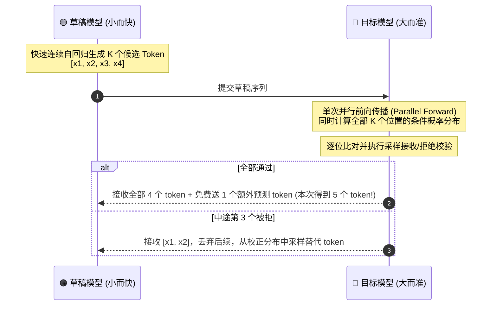

# Lab 10：投机采样 (Speculative Decoding) 原理与算法仿真

## ❓ 为什么需要投机采样？

在 Lab 08 中我们已经知道：
- **自回归 Decode 阶段是访存带宽受限（Memory-Bound）的**。
- 大模型每生成 1 个 token，就必须把整个模型的权重（数十 GB）完整搬运一次，因此单步延迟很难降低。
- 但如果同时输入 $K$ 个 token（如 Prefill 阶段），GPU 的算力利用率大幅提高，耗时**几乎与输入 1 个 token 相同**！

**投机采样（Speculative Decoding）的洞察**：
> "与其每次花很长时间让昂贵的大模型只猜 1 个词，不如让一个廉价的小模型快速一口气猜 $K$ 个词，再让大模型做一次并行前向传播进行批量验证！"

---

## 🔄 核心算法流程

假设目标大模型为 $M_{\text{target}}$，轻量草稿模型为 $M_{\text{draft}}$（参数量通常仅为大模型的 $1/10 \sim 1/5$）：



### 严格的数学无偏性保证 (Unbiased Sampling)
投机采样最迷人的特点是：**完全无损（Lossless）**。
通过巧妙的拒绝采样概率公式：
$$ \alpha = \min\left(1, \frac{P_{\text{target}}(x)}{P_{\text{draft}}(x)}\right) $$
- 若以概率 $\alpha$ 接受草稿 token $x$；
- 若拒绝，则根据校正后的残差分布采样：
  $$ P_{\text{residual}}(x) = \frac{\max(0, P_{\text{target}}(x) - P_{\text{draft}}(x))}{\sum \max(0, P_{\text{target}}(x') - P_{\text{draft}}(x'))} $$
数学上严格证明：**无论草稿模型多弱，最终生成的文本统计分布与单独用大模型生成 100% 完全一致！**
（草稿模型越弱，只会让接受率变低、加速比变小，而不会改变输出分布。）

> 📐 **证明在哪？** 完整的逐行证明见 [第 10 篇：投机解码](../zero_to_hero_tutorial/10_投机解码：无偏性证明与期望加速比.md)；
> 用蒙特卡洛实验"亲眼验证"这个定理，请运行 [`verify_unbiasedness.py`](verify_unbiasedness.py)。
>
> ⚠️ 注意：本目录的 `toy_speculative_decoding.py` 里，接收/拒绝只用了 **被采样 token 的一个概率值**，所以是正确的；
> 但 `p_target / p_draft` 必须用**同一个前缀**下的两个分布——这一点在真实实现里最容易写错。

---

## 🏃 运行仿真实验

运行 [`toy_speculative_decoding.py`](toy_speculative_decoding.py)：
```bash
python3 lab10_speculative_decoding/toy_speculative_decoding.py
```
本脚本模拟了草稿模型与目标模型的联合采样过程，展示每轮投机接受长度、大模型调用次数节省比例及端到端加速比。

```bash
python3 lab10_speculative_decoding/verify_unbiasedness.py
```
对同一个前缀重复做 20 万次"投机采样的一步"，统计输出 token 的经验分布，与目标模型分布逐项比较（总变差距离应趋近 0），并给出理论接受率 $\sum_x \min(p, q)$ 与期望加速比公式的实测验证。还会演示两种**常见错误写法**（拒绝后直接从 $p$ 或 $q$ 重采样）如何让分布产生 11%~17% 的总变差偏差。
