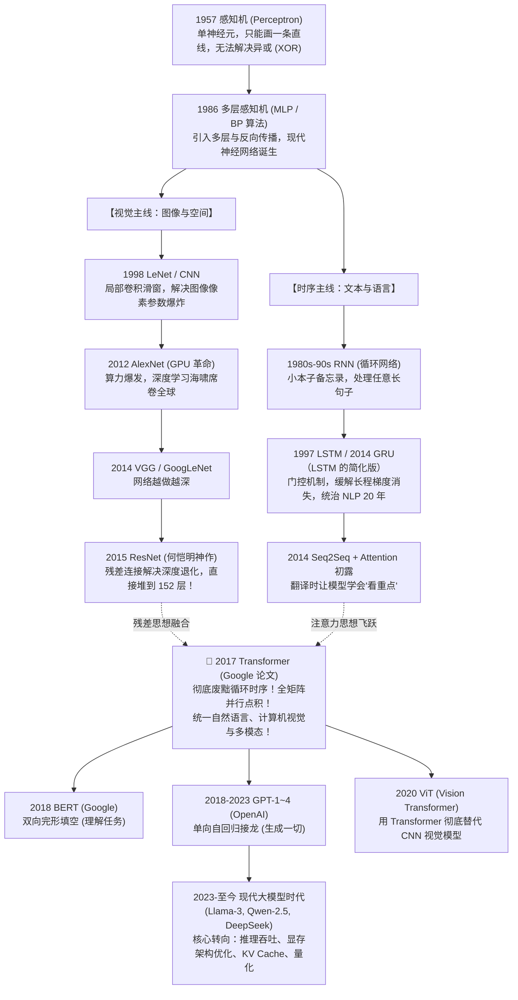

# 第 0 篇（导读）：AI 深度学习全景族谱与零基础入门指南

> **前言**：深度学习领域充斥着各种各样的“Net”（如 CNN、RNN、ResNet、Transformer、Diffusion），初学者极易迷失在浩瀚的术语海洋中。本篇为你梳理整张「AI 科技树」，讲清楚各种网络各司其职的关系，并给出最少弯路、最落地的零基础入门路线。

---

## 🌳 一、深度学习终极演化科技树（全景族谱）

整个现代 AI 的发展，本质上只由两条主线驱动：**视觉线（看图像）** 和 **语言时序线（读文本）**。它们在经历各自数十年的探索后，最终被 **Transformer** 完成大一统！

---

## 🧭 二、各种“Net”究竟都是干什么的？

当你看到不同论文或文章里提到不同的 Net 时，可以对照下表快速定位：

| 模型代号 | 全称 | 诞生初衷与解决的核心痛点 | 状态与历史地位 |
| :--- | :--- | :--- | :--- |
| **MLP** | Multi-Layer Perceptron (多层感知机 / 全连接网络) | 最基础的万能函数拟合器，全连接矩阵乘法。但输入长度固定，无法直接处理大图像和长文章。 | 所有现代网络的基本积木（如 Transformer 里的 FFN） |
| **CNN** | Convolutional Neural Network (卷积神经网络) | **专为图像而生**。一张 1000x1000 的图片直接用全连接会导致参数爆炸，CNN 用一个小滑窗（卷积核）扫过图片提取边缘和纹理。 | 统治计算机视觉领域（2012-2020），经典代表：LeNet, AlexNet, VGG |
| **ResNet** | Residual Network (残差网络) | 网络堆得太深（超过 20 层）会导致梯度消失退化。何恺明发明**残差短路连接（$x + F(x)$）**，让网络轻松堆到 152 层甚至 1000 层！ | **现代所有大模型的标配机制**（Transformer 每层都有残差连接） |
| **RNN** | Recurrent Neural Network (循环神经网络) | **专为文本时序而生**。像穿糖葫芦一样逐字传递隐藏状态备忘录，解决文本长度不一的问题。 | 因串行无法利用 GPU 并行，且长程记忆衰减，已被淘汰 |
| **LSTM** | Long Short-Term Memory (长短期记忆网络) | 在 RNN 基础上引入遗忘门、输入门、输出门，缓解了 RNN 读到后面忘了前面的死穴。 | 在 2017 年前是机器翻译、语音识别的绝对霸主 |
| **Transformer** | 基于 Self-Attention 的全新网络架构 | **彻底废弃循环连接**，任意两词距离 $O(1)$，纯矩阵运算极致利用 GPU。不仅统领自然语言，还通过 ViT 杀入计算机视觉，通过 Sora/Diffusion 杀入视频生成。 | **当今全人类所有大模型的唯一通用底座** |

---

## 🎯 三、新手零基础想真正入门，该看什么？（绝不踩坑三部曲）

网上的 AI 教程铺天盖地，90% 都是死记硬背公式或调包调库，初学者往往陷入“懂了但又没完全懂”的痛苦中。

想要扎实、高效、不浪费时间地入门，**推荐且仅推荐以下三部封神级的黄金资源**：

### 🥇 阶段 1：建立直观的数学与几何世界观（耗时约 2~3 天）
* **【绝对首选】3Blue1Brown 经典动画教程《深度学习的本质》（Bilibili / YouTube 免费看）**
  * 搜索关键词：`3Blue1Brown 深度学习`
  * 为什么神：全网最好的几何可视化，用生动的动态图形讲清楚：
    - 什么是神经网络与激活函数？
    - 什么是梯度下降（走下山坡）？
    - 反向传播微积分链式法则的几何动画。
    - 注意力机制（Attention）到底在几何空间中拉伸了什么。
  * **建议**：把这 4 集视频当作看电影，看上两遍，你脑海里的数学直觉就彻底打通了！

### 🥈 阶段 2：动手写代码与经典教科书（耗时约 1~2 周）
* **【教材推荐】李沐（前亚马逊首席科学家）团队《动手学深度学习》(Dive into Deep Learning / d2l.ai)**
  * 中文官网完全免费在线阅读，配备完整可运行代码。
  * 从基础张量、线性回归、MLP 讲到现代注意力机制，文字极度平实。
* **【硬核进阶】Andrej Karpathy（OpenAI 联合创始人、前特斯拉 AI 总监）的视频系列《Neural Networks: Zero to Hero》**
  * 他在油管上从一个只有几行的微型框架 `micrograd` 开始，用纯 Python 逐行写出一个微型 GPT（nanoGPT）。
  * 跟着他敲一遍，大模型的黑盒彻底透明。

### 🥉 阶段 3：大模型推理与系统实战（面向生产与高性能）
* **【避坑指南：不要一上来就学“从零预训练大模型”】**
  * 训练一个 70B 模型需要几千张英伟达 H100 显卡和几千万美元预算，对绝大多数工程师而言，学如何从头训练一个大模型完全脱离现实。
* **【正确的工程路径：深耕大模型推理（LLM Inference）】**
  * 理解模型的前向传播逻辑与微观张量流（参见本项目的 `lab04_transformer_microscope`）；
  * 理解为什么推理的核心瓶颈在于**显存容量与内存带宽（Memory Bandwidth）**（参见 `lab08_memory_and_roofline`）；
  * 深入业界工业标准框架（**vLLM**、**SGLang**、**llama.cpp**），学习它们的核心技术：**PagedAttention**、**连续批处理（Continuous Batching）**、**投机采样**、**量化**；
  * 这也是当前 AI Infra、大模型私有化部署、高性能边缘计算最紧缺、含金量最高的技术方向！

---

> 🧭 **本仓库的完整路线**：上面三部曲是外部资源的推荐；本仓库自己的 14 篇理论（第 0~13 篇）+ 配套实验，以及它们与外部资源如何穿插学习，见 [LEARNING_PATH.md](../LEARNING_PATH.md)。
> 族谱里没有展开的细节——注意力在 2014 年的真正起源、从原版 Transformer 到 Llama/DeepSeek 的每一处改动——在 [第 5 篇](05_从原版Transformer到Llama与DeepSeek：每一处改动的历史动机.md)。

---

**下一篇**：[第 1 篇：计算机如何读懂语言？从人工规则到大模型演进史](01_人类如何让计算机理解语言：从规则到大模型演进史.md) ｜ **总路线**：[LEARNING_PATH.md](../LEARNING_PATH.md)
